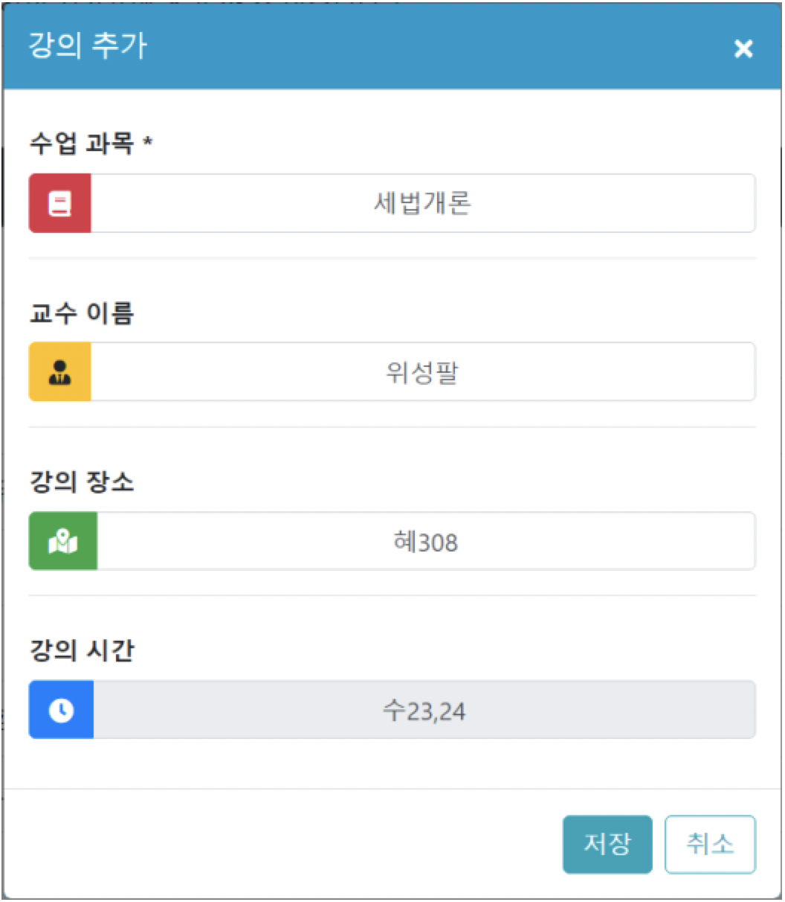
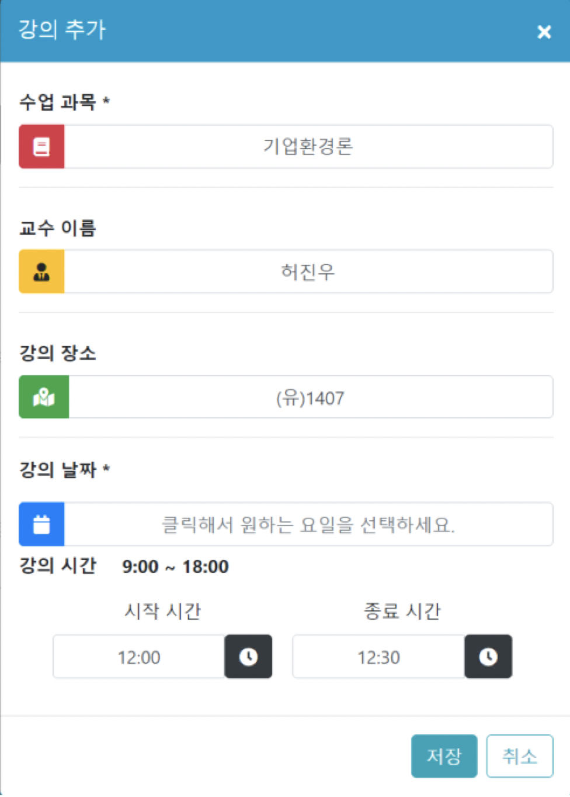
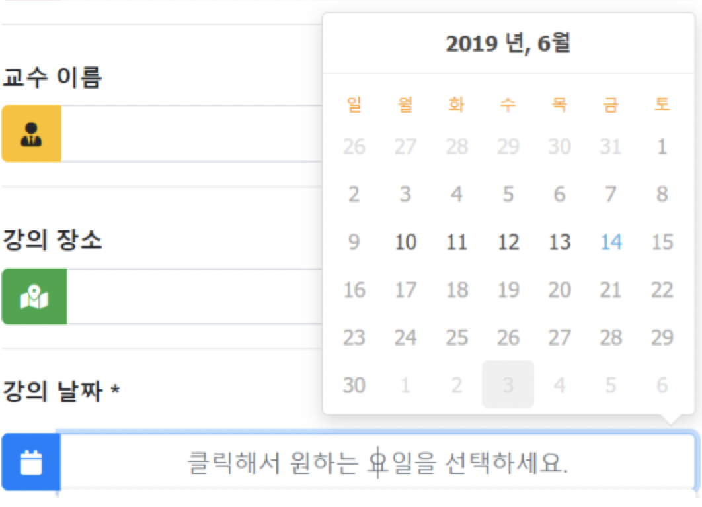
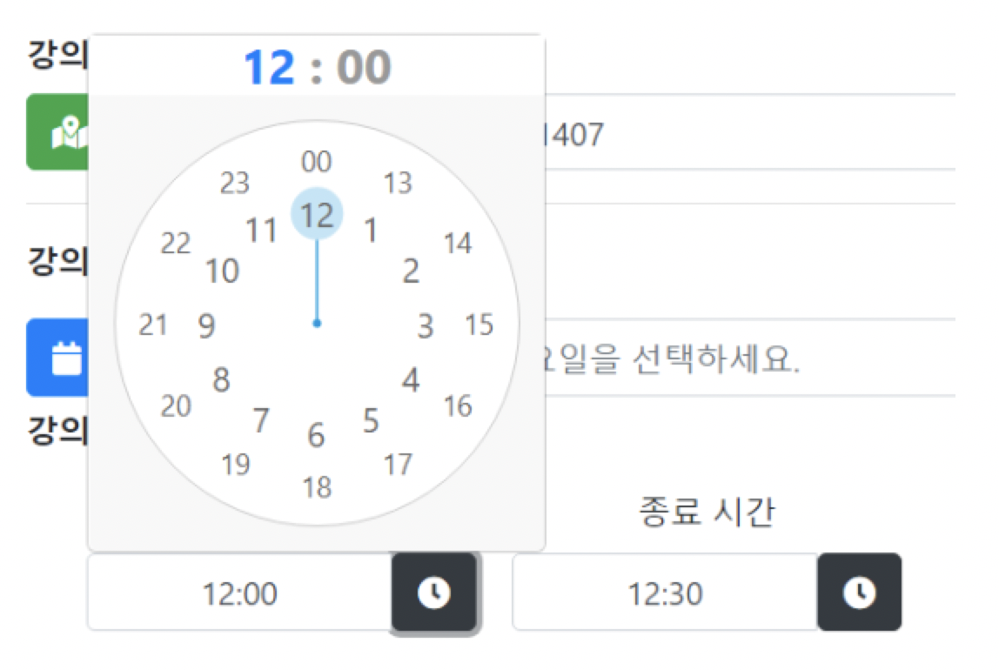

# TimeManager

## Spring 대학교 시간표 관리 프로젝트

#### 서비스 개요
교내 학생들에게 보다 쉽고 빠른 인터페이스와 실제 강의 데이터를 이용한 강좌 관리를 제공하기 위함

#### 학생 사용자층 선정 이유는?
대학생을 상대로 어떤 웹 서비스가 있으면 좋을까 생각했고, 팀원 둘 모두 대학생에 대해 잘 알고 있으니 학생들을 위한 서비스를 하면 실용적이고 만족도 높은 서비스를 만들 수 있을 거라 생각 했습니다.   
그래서 대학생의 시간을 관리 해주고, 사용자 개개인이 많은 팀프로젝트를 수행 하는 부분에 있어서 쉽게 관리 해 줄 수 있는 부분에 대해서 생각했고, 어떻게 하면 도움을 줄 수 있을 지 생각 했습니다. 

## 서비스 구성도

## 서비스 주요 기능

### 서비스 주요 기능 설명
대학생의 시간을 관리 해주기 위해서 실제 서경대학교의 강좌 정보를 에브리타임 사이트에서 셀레니움 + bs4를 사용하여 데이터를 추출하였고 강좌 정보를 이용하여 사용자가 버튼 두번으로 강의 정보를 등록하면 시간표 페이지와 일정 관리 페이지에 데이터가 저장되므로 사용자는 원하는 강의를 등록하면 시간표 테이블로 볼 수 있고(강의 등록) 일정을 관리하며(휴강,시험,과제) 일,주,월 단위로 관리가 가능합니다. 
 
또한, 그룹별로 방을 만들고, 팀활동을 할수 있으면 좋겠다는 생각을 하였고 방을 만들어 팀프로젝트를 하거나 스터디를 할 수 있는 방향으로 생각을 하고 이런 기능들을 위주로 만들었습니다. 사람들이 방(그룹)에 참여하고 나가는 기능 , 방(그룹)마다 협업 스터디를 위한 기능이 필요하다 생각했습니다. 
게시판을 이용해 글을 쓰고 어떤 공부를 했는지 , 어떤 과제가 있었는지 올릴 수 있고, 모르는게 있거나 직접 만나지 못하는 경우가 있다면 채팅으로 언제든지 실시간 이야기를 할 수 있는 기능들을 만들었습니다. 

## 실행 결과 화면

## 서비스 구현 파트

### 1. 강의 목록 검색 기능

#### 강의 조회

강좌 목록을 검색하거나 강좌의 세부 정보를 확인 할 수 있습니다.  
페이징 기능과 원하는 강좌를 클릭하여 시간표와 일정에 추가할 수 있습니다.

#### 강의 검색

전공과목을 검색하려면 전공코드 앞 두자리를 검색하여 조회할 수도 있습니다.

### 2. 강의 추가 기능

#### 시간이 등록되어 있는 강의인 경우
  

강의 시간이 저장되어 있는 데이터들은 위와 같이 읽기만 가능해지고 저장을 누르면 수23, 24시 시간에 맞게 시간표와 일정에 자동 추가

#### 시간이 등록되어 있지 않는 강의인 경우
  

강의 날짜와 시간을 사용자가 직접 추가 할 수있습니다.

 

날짜는 월요일부터 금요일 까지 등록 가능합니다.

 

강의 시간은 시작시간과 종료시간을 입력 할 수 있고 09:00 ~ 18:00 사이의 시간만 추가가 가능합니다.  
종료시간이 시작시간보다 빠를수는 없습니다.

### 3. 일정 관리 기능

일정을 일간, 주간, 월간별로 볼 수 있고 개인 일정을 추가, 수정하거나 삭제 할 수 있습니다.  
위 강의 추가 기능에서 추가했던 정보들이 시간표와 알정 모두 동기화 되어 보여집니다.

시간표는 서로 중복되게 만들 수 없고 월요일부터 금요일까지만 표시되고 시간은 09:00 ~ 18:00 까지 등록이 가능합니다.  
드래그해 시간표를 옮길 수도 있고 이벤트박스의 아래를 클릭해서 시간을 늘리거나 수정할 수 있습니다.

